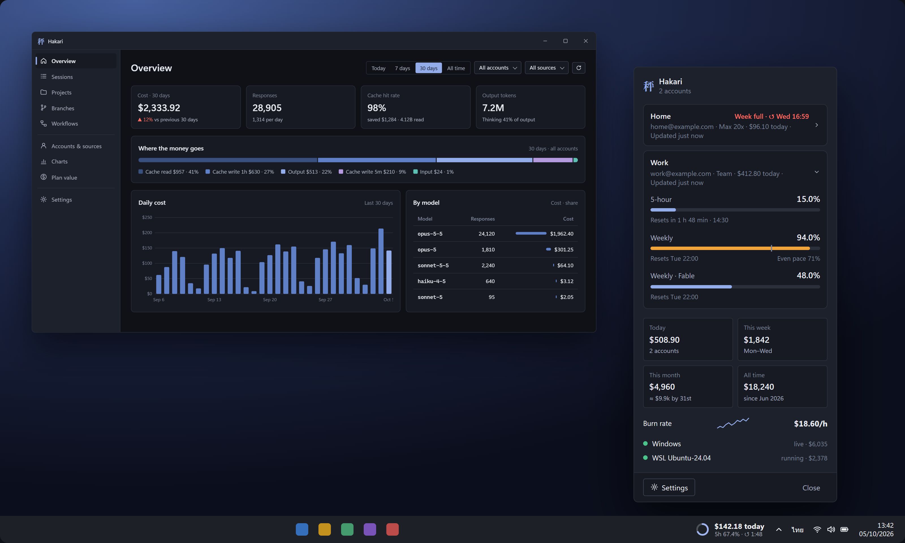
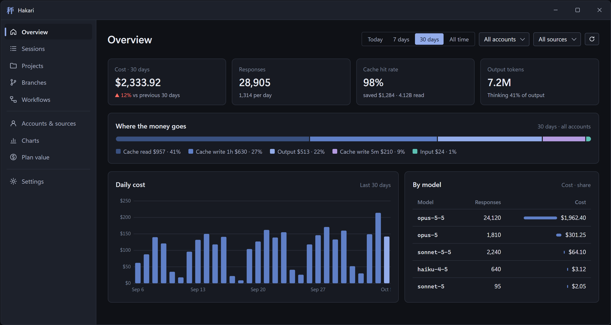

# Hakari 秤

A lightweight Windows taskbar meter and dashboard for **Claude Code** usage. It combines every place you use Claude Code on your PC (Windows, WSL distributions, extra config folders) and every account into one real total.

<a href="https://apps.microsoft.com/detail/9NFVF39T2447?mode=direct">
  <picture>
    <source media="(prefers-color-scheme: dark)" srcset="https://get.microsoft.com/images/en-us%20light.svg">
    
  </picture>
</a>

> Not affiliated with or endorsed by Anthropic. "Claude" is a trademark of Anthropic, PBC.



- Live cost, limits and burn rate on the taskbar, in a layout you choose
- Incremental indexing: reads only new log bytes, so it stays fast with logs of several GB
- Correct cache pricing (5-minute vs 1-hour cache writes, fast mode)
- Local-only. Hakari never reads prompt or response text and sends no telemetry.



<sub>Pictures use made-up sample accounts and numbers.</sub>

Status: **early release**. See [docs/ARCHITECTURE.md](docs/ARCHITECTURE.md) for how it works and [docs/PRIVACY.md](docs/PRIVACY.md) for what it reads and sends.

## Install

Windows 10 (2004) or later, x64 or Arm64. Hakari is free everywhere; pick one:

| Where | How | Updates |
|---|---|---|
| **Microsoft Store** | [Hakari - Usage Meter](https://apps.microsoft.com/detail/9NFVF39T2447) | Automatic, through the Store |
| **winget** | `winget install PHUICMT.Hakari` *(in review, coming soon)* | `winget upgrade PHUICMT.Hakari` |
| **Zip** | [Releases](https://github.com/PHUICMT/hakari/releases): `Hakari-<version>-win-x64.zip`, or `win-arm64` for Windows on Arm | From 0.9.3, **Update now** in the flyout (or *Settings → About → Check for updates*) |

**Zip:** unzip it where you keep apps, such as `%LOCALAPPDATA%\Programs\Hakari`, and run
`Hakari.exe`. Nothing else to install: .NET and the Windows App SDK come inside. The zip is not
code-signed yet, so SmartScreen may warn on first run; choose **More info → Run anyway**. Each
release lists the zip's SHA-256 beside it. From 0.9.3 Hakari downloads, checks and swaps in a
newer version itself; before that, quit Hakari from its tray menu and replace the folder.
Settings stay either way.

On first run the meter appears on the taskbar next to the tray, and a short guide opens.
Left-click the meter for the flyout, right-click it for the dashboard, settings and more.

**Uninstall:** Store or winget, uninstall as usual (*Settings → Apps*, or
`winget uninstall PHUICMT.Hakari`). Zip: turn off *Start with Windows* in Settings, quit from
the tray menu and delete the folder. Settings and the usage index live in
`%LOCALAPPDATA%\Hakari`; delete that too to remove everything.

## FAQ

**What does Hakari count?**
Cost and tokens come from the logs Claude Code writes on this PC. The 5-hour and weekly
limits come from your account, so they include everything.

| Where you use Claude | Cost and tokens | 5-hour and weekly limits |
|---|---|---|
| Claude Code on this PC: terminal, VS Code, JetBrains, the Claude desktop app's Code tab, WSL | Yes | Yes |
| Claude Code on another PC, or in the cloud | No, only this PC's logs | Yes, the limits include it |
| Chat on claude.ai, in the Claude apps, or Cowork | No, it leaves no usage on the PC | Yes, the limits include it |

Limits need Claude Code signed in on this PC once, and limits turned on for that account.

**Is the cost what I pay?**
No. It is what the same tokens would cost at API prices, from the price table Hakari ships
(updated through *Settings → Prices*). On a subscription you pay the plan's price; the
*Plan value* page compares the two.

**It says "No Claude Code logs found".**
Hakari looks for `.claude` folders in your user folder and in WSL. Use Claude Code once and the
numbers appear, or add a folder under *Settings → Sources → Extra config folders*.

**My WSL usage is missing.**
By default Hakari only reads distributions that are running, so it never starts one by
itself. Open the distribution once, or choose *All* under *Settings → Sources → WSL
distributions* (that can start stopped distributions).

**How does it know my 5-hour and weekly limits?**
Only for accounts where you turn limits on (the flyout asks once per account). Hakari then
uses the sign-in Claude Code keeps on your PC to ask Anthropic for that account's usage, and
nothing else. Turned off, it shows an estimate from your own usage instead. See
[PRIVACY.md](docs/PRIVACY.md).

**I can't see the meter on the taskbar.**
When the taskbar has no room, the meter first shrinks to a compact form, then moves to the
tray icon, which shows your limit and opens the same flyout. It comes back when room frees up.

**Will it slow my PC down?**
It runs at low priority, reads only the new part of each log, never wakes WSL, and stays idle
while nothing changes.

**Several accounts?**
Yes. Each signed-in account gets its own limits; the taskbar can show them side by side or take
turns, and the dashboard filters by account.

## Dev

```powershell
dotnet test
dotnet run --project src/Hakari.Cli -c Release            # scan %USERPROFILE%\.claude\projects
./tools/Publish-Release.ps1 -Version 1.0.0 -Architecture x64   # portable zip in artifacts/release
./tools/Publish-StoreUpload.ps1 -Version 1.0.0                 # x64 + arm64 .msixupload for the Store
```

A tag such as `v1.0.0` runs [.github/workflows/release.yml](.github/workflows/release.yml): it
tests, builds both zips and the Store upload, publishes the GitHub release, and sends the
winget and Store updates.

## Support

Hakari is free. If it helps you: [GitHub Sponsors](https://github.com/sponsors/PHUICMT) ·
[Ko-fi](https://ko-fi.com/phuicmt), or a tip from the About page in the Store version.

## License

MIT
